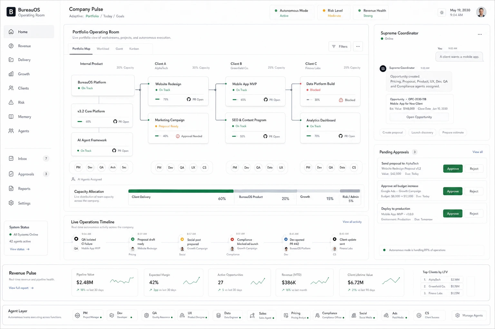

# Operating Room UI Reference

This document is the canonical reference for the BureauOS owner interface, captured from the design mock shared by the founder.



The image above is the source mock. The textual description below is the implementation contract — when the two diverge, the text wins and the mock is treated as design direction.

## Top-Level Concept

The interface is called the **Operating Room**. It is the single command center for the owner.

Principles confirmed by the mock:

- one conversation surface: the Supreme Coordinator panel on the right
- one adaptive view: the center work area changes based on what matters right now (portfolio, today, goals)
- always-visible business health: top bar shows autonomous mode, risk level, revenue health
- always-visible revenue strip at the bottom (pipeline, margin, opportunities, MTD revenue, LTV)
- always-visible agent layer at the very bottom (the company "org chart" the user can hover into)

The interface should feel like an operating room for a real company, not a 2026 enterprise admin panel.

## Page Layout

```
+---------------------------------------------------------------------------+
| Header (logo + adaptive breadcrumb + status pills + date + user avatar)   |
+---------+----------------------------------------------+------------------+
| Sidebar | Center work area                             | Right rail       |
|         | (Portfolio Operating Room / Today / Goals)   | (Coordinator     |
|         |                                              |  chat +          |
|         |                                              |  Pending         |
|         |                                              |  Approvals)      |
|         +----------------------------------------------+                  |
|         | Live Operations Timeline                     |                  |
|         +----------------------------------------------+                  |
| System  | Revenue Pulse (KPI strip)                                       |
| Status  +-----------------------------------------------------------------+
|         | Agent Layer (functional roles)                                  |
+---------+-----------------------------------------------------------------+
```

## Header

- Logo + "BureauOS — Operating Room"
- Breadcrumb / adaptive selector: `Adaptive: Portfolio | Today | Goals`
- Three status pills, each with a colored dot:
  - `Autonomous Mode — Active` (green)
  - `Risk Level — Moderate` (amber)
  - `Revenue Health — Strong` (green)
- Date and time on the right
- User avatar

## Left Sidebar

Primary navigation, top to bottom:

- Home
- Revenue
- Delivery
- Growth
- Clients
- Risk
- Memory
- Agents

Secondary navigation (with counters/badges):

- Inbox (counter)
- Approvals (counter)
- Reports
- Settings

System Status card at the bottom:

- "All Systems Online"
- "N agents active"
- "View status" link

## Center: Portfolio Operating Room

Title: `Portfolio Operating Room`
Subtitle: `Live portfolio view of workstreams, projects, and autonomous execution.`

Tabs:

- Portfolio Map (selected in the mock)
- Workload
- Gantt
- Kanban

Top-right controls: Filters button, overflow menu.

### Portfolio Map

Columns represent client buckets, each with a capacity percentage:

- Internal Product (e.g. 20% capacity)
- Client A (e.g. 30% capacity)
- Client B (e.g. 25% capacity)
- Client C (e.g. 25% capacity)

Each column contains one or more **project cards** stacked vertically with connecting lines that show dependencies between cards.

### Project Card

Fields:

- Project name (e.g. "Website Redesign")
- Status pill (`On Track`, `Blocked`, `Proposal Ready`, `Approval Needed`)
- Progress bar with percentage
- Right-side action: `PR Open` link (when a pull request exists)
- Below the card, a row of **agent chips** showing which roles are assigned (PM, Dev, QA, UX, Arch, Sec, CS, Data, ...)
- "AI Agents Assigned" caption when the row is present

### Capacity Allocation

A horizontal stacked bar under the portfolio columns:

- Client Delivery (largest segment, ~60%)
- BureauOS Product (~20%)
- Growth (~15%)
- Risk / Admin (~5%)

Caption: `Live distribution of team capacity across the company.`

## Center (lower): Live Operations Timeline

Title: `Live Operations Timeline`
Subtitle: `Real-time autonomous activity across the company.`
Right link: `View all activity`

A horizontal timeline of recent events. Each event has:

- Time (e.g. `9:04 AM`)
- Icon (colored dot or status icon)
- Event title (e.g. "QA isolated CI failure")
- Project tag (e.g. "Mobile App MVP")
- Agent tag below (e.g. "QA")

Events span the full company: delivery (Dev opened PR), growth (Social post prepared), compliance (Compliance blocked ad launch), sales (Proposal draft ready), client success (Client update sent), etc.

## Right Rail

### Supreme Coordinator Panel

Header:

- "Supreme Coordinator" with online indicator
- Overflow menu

Chat thread (newest at bottom):

- User message bubble: `"A client wants a mobile app."`
- Assistant message from `SC` (Supreme Coordinator) reading like an operational acknowledgement: `"Opportunity created. Pricing, Proposal, Product, UX, Dev, QA and Compliance agents assigned."`
- An **embedded artifact card** below the assistant message:
  - Title: `Opportunity`
  - ID: `OPC-YYYY-NNN`
  - Subtitle: `Mobile App for New Client`
  - `Est. Value: $148,000`
  - `Close Date: Jun 10 2030`
  - Button: `Open Opportunity`
- Quick action chips under the message: `Create proposal`, `Launch discovery`, `Prepare estimate`

### Pending Approvals Panel

Header: `Pending Approvals (N)` with `View all` link.

Each approval row:

- Title (e.g. "Send proposal to AlphaTech")
- Subtitle (artifact reference, e.g. "Website Redesign Proposal v1.2")
- Metadata (e.g. `Value: $42,500`, `Due: Today`)
- Two buttons: `Approve` (primary) / `Reject` (secondary)

Approval types shown in the mock:

- Send proposal to client
- Approve ad budget increase
- Deploy to production

Footer note: `Autonomous mode is handling NN% of operations.`

## Revenue Pulse (KPI Strip)

Title: `Revenue Pulse`
Subtitle: `Real-time revenue and pipeline health.`
Left link: `View full report`

KPI cards, each with a sparkline and a delta vs. the previous period:

- Pipeline Value (e.g. `$2.48M` — +18% vs last 30 days)
- Expected Margin (e.g. `42%` — +3pp vs last 30 days)
- Active Opportunities (e.g. `27` — +5 vs last 30 days)
- Revenue (MTD) (e.g. `$386K` — +16% vs last month)
- Client Lifetime Value (e.g. `$6.72M` — +21% vs last 90 days)

Right column: `Top Clients by LTV` ranked list (e.g. AlphaTech $2.14M, Greenfield Co. $1.78M, Finova Labs $1.23M).

## Agent Layer (Footer)

Title: `Agent Layer`
Subtitle: `Autonomous teams executing across functions.`
Right button: `Manage Agents`

A horizontal strip of role chips, each with an icon, role label, and function label:

- PM — Project Manager
- Dev — Developer
- QA — Quality Assurance
- UX — Product Designer
- Data — Data Engineer
- Sales — Sales Agent
- Pricing — Pricing Analyst
- Compliance — Compliance Officer
- Social — Social Media
- Ads — Paid Media
- CS — Client Success

This row is the "always-visible org chart" the user can click into to inspect any function.

## Adaptive Behavior

The center area is adaptive. The mock shows "Portfolio" mode. The system should also support:

- **Today** mode — focus on what needs decision today (approvals, blockers, urgent risks)
- **Goals** mode — focus on business goals, OKRs, milestone progress

The adaptive selector at the top of the page switches between these.

## Visual Style

Direction taken from the mock:

- light, neutral background (off-white)
- generous whitespace
- soft borders and subtle shadows
- color used sparingly for status (green/amber/red dots, green primary CTAs)
- monospace numerals in KPI cards
- minimal iconography
- typography: clean sans-serif, medium weight for titles, regular for body

The aim is a calm, focused operating environment. Avoid dense enterprise table layouts and avoid "AI chrome" (no flashy gradients or generative-art motifs).

## Mobile

The mock is desktop, but the design must collapse cleanly to mobile per [owner-interface.md](../owner-interface.md):

- one-column layout
- Coordinator chat becomes the default surface
- Pending Approvals collapses into a sheet
- KPI strip becomes a horizontal scrollable row
- Agent Layer collapses into a menu

## Mapping to Memory and Kernel

Every region of the UI is a view over kernel state, not a separate source of truth.

| UI region | Backing state |
|---|---|
| Header status pills | Kernel health monitor + policy state |
| Sidebar counters | Inbox, Approvals registries |
| Portfolio Map | Project registry + run state |
| Capacity Allocation | Run engine + agent load |
| Live Operations Timeline | Audit log + run events |
| Coordinator chat | Coordinator runtime + executive memory |
| Pending Approvals | Approvals registry |
| Revenue Pulse | Opportunity registry + client revenue memory |
| Agent Layer | Agent registry + capability registry |

## Build Order Implication

The Owner Interface MVP (roadmap v0.3) should not try to ship all of this at once. The minimum surface needed to validate the design:

1. Sidebar shell + adaptive header
2. Portfolio Map (read-only, from project registry)
3. Coordinator chat panel (read-only first, then connected)
4. Pending Approvals (read-only first, then with approve/reject)
5. Revenue Pulse KPIs (from opportunity registry)
6. Live Operations Timeline (from audit log)
7. Agent Layer footer
8. Today / Goals adaptive modes
9. Mobile responsive pass

See `BACKLOG.md` at the repository root for the task breakdown.
